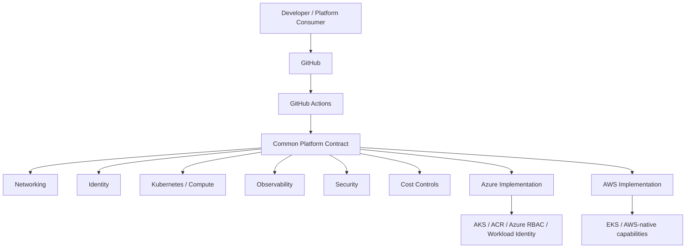

# Multi-Cloud Platform Engineering

<p align="center"><strong>Azure-first platform engineering with explicit AWS portability.</strong></p>

<p align="center">


</p>

A platform-engineering reference implementation centered on **Azure AKS**, while preserving explicit AWS portability. The project demonstrates how networking, identity, Kubernetes, observability, security and delivery controls can be expressed as a platform contract without pretending cloud providers are identical.

## Azure flagship track

The Azure implementation now includes inspectable Terraform for:

- Resource group and governance tags
- Azure VNet and dedicated AKS subnet
- Azure Kubernetes Service
- Cluster autoscaling
- Azure RBAC integration
- OIDC issuer and workload identity
- Azure Container Registry
- Least-privilege `AcrPull` assignment
- Log Analytics integration
- CI validation with GitHub Actions

Start here:

- [Azure AKS Terraform](terraform/azure/main.tf)
- [Azure architecture](docs/azure-aks-architecture.md)
- [Azure CI validation](.github/workflows/azure-terraform-validate.yml)

## Platform architecture



## Platform contract

`network → identity → compute/Kubernetes → observability → security → cost controls`

The goal is a common engineering contract with provider-aware implementations. Portability is achieved at the workload and platform-interface level while provider-specific capabilities remain visible.

## Capability matrix

| Capability | Azure | AWS | Portability approach |
|---|---|---|---|
| Networking | VNet / subnet | VPC / subnet | Common network contract |
| Identity | Entra ID / Azure RBAC / workload identity | IAM / workload identity patterns | Identity interface |
| Kubernetes | AKS | EKS | Kubernetes workload contract |
| Registry | ACR | ECR | Image supply-chain interface |
| Observability | Azure Monitor / Log Analytics | CloudWatch / managed integrations | Standard telemetry concepts |
| Security | Azure Policy / Defender patterns | AWS-native controls | Policy requirements |
| Cost | Azure budgets/cost management | AWS cost controls | Governance contract |

## Engineering signals

- Azure AKS Infrastructure as Code
- Managed identity and workload identity design
- Least-privilege registry access
- Cluster autoscaling and network-policy configuration
- Provider-aware abstractions
- Kubernetes portability considerations
- Identity/network/security tradeoffs
- Terraform validation and unit tests

## Quick start

Validate the Azure implementation without creating cloud resources:

```bash
terraform -chdir=terraform/azure fmt -check -recursive
terraform -chdir=terraform/azure init -backend=false
terraform -chdir=terraform/azure validate
```

Run repository tests:

```bash
pytest -q
```

## Engineering tradeoff

**Abstract the interface, not away the cloud.** Azure and AWS expose different identity, networking, observability and security capabilities. The platform contract should give developers consistency without forcing both providers into a lowest-common-denominator architecture.

## Production hardening path

For a live Azure environment, the next controls would include private AKS access, private endpoints, Key Vault integration, environment promotion, Azure Policy, Defender for Cloud, zone-aware node pools, backup/restore validation, tested RTO/RPO, alert routing and cost budgets.

## Scope

This repository is a portfolio/reference implementation. It contains infrastructure code and architecture decisions but does not claim that the Azure or AWS resources shown here are currently running in a customer production environment.
