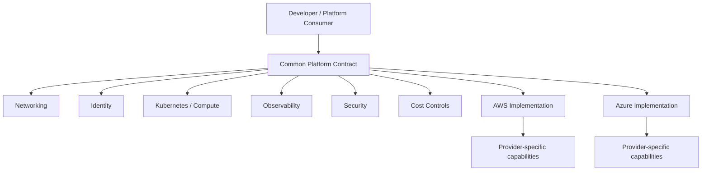

# Multi-Cloud Platform Engineering

<p align="center"><strong>Portable platform contracts without pretending clouds are identical.</strong></p>

<p align="center">


</p>

A multi-cloud architecture lab focused on the hard part of AWS + Azure: defining portable platform contracts while preserving provider-specific capabilities.

## Platform architecture



## Platform contract

`network → identity → compute/Kubernetes → observability → security → cost controls`

Terraform examples are separated by provider. Python validates that environment requirements are compatible with a selected cloud rather than pretending the clouds are identical.

## Capability matrix

| Capability | AWS | Azure | Portability approach |
|---|---|---|---|
| Networking | VPC | VNet | Common network contract |
| Identity | IAM | Entra ID / RBAC | Identity interface |
| Kubernetes | EKS | AKS | Kubernetes workload contract |
| Observability | Cloud-native integrations | Azure-native integrations | Standard telemetry concepts |
| Security | AWS controls | Azure controls | Policy requirements |
| Cost | AWS cost controls | Azure cost controls | Governance contract |

## Engineering signals

- AWS and Azure capability matrix
- provider-aware abstractions
- Kubernetes portability considerations
- identity/network/security tradeoffs
- policy and environment validation
- Terraform validation + unit tests

## Quick start

```bash
terraform fmt -check -recursive
terraform validate
pytest -q
```

## Design principle

**Abstract the interface, not away the cloud.** Provider differences remain explicit so portability does not become a lowest-common-denominator architecture.

Reference architecture only; no cloud deployment is claimed.
