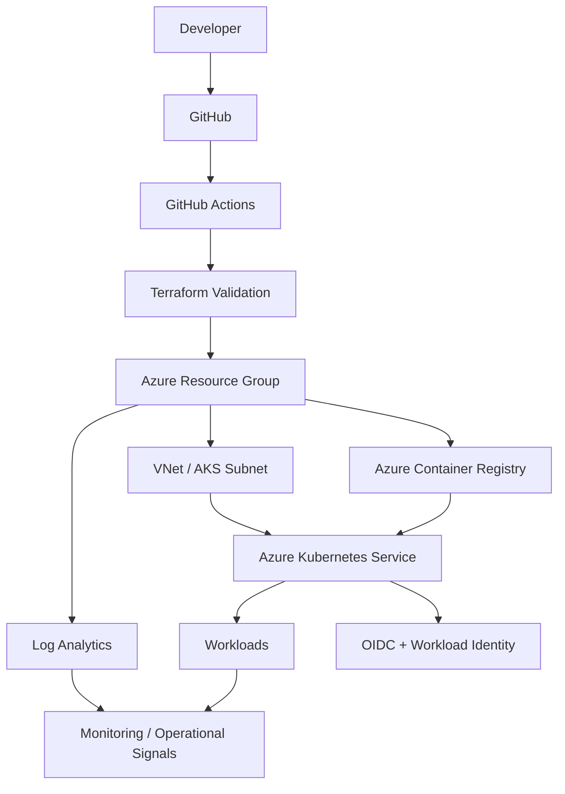

# Azure AKS Platform Architecture

## Goal

Provide an Azure-first platform foundation that demonstrates how cloud infrastructure, identity, Kubernetes, observability and delivery controls fit together for DevOps, platform engineering and SRE work.

## Architecture

## Design decisions

### AKS

AKS provides the Kubernetes control plane while retaining Kubernetes-native application patterns. The node pool is autoscaling-enabled to demonstrate capacity management rather than fixed sizing.

### Azure CNI and network policy

The cluster uses Azure networking integration and network policy to keep network design explicit. In a live environment, subnet sizing should be based on pod density, node growth and expected service expansion.

### Managed identity and workload identity

The cluster uses managed identity, with OIDC/workload identity enabled so workloads can access Azure resources without embedding long-lived cloud credentials.

### ACR

Azure Container Registry represents the platform image registry. The AKS kubelet identity receives `AcrPull` rather than registry administrator credentials.

### Log Analytics

The reference includes an Azure Monitor/Log Analytics integration point for platform telemetry. A production implementation would define retention, alert rules, action groups, dashboards and ownership standards.

## Production hardening path

A live enterprise deployment should consider private AKS API access, private endpoints, Azure Firewall/NAT design, Key Vault CSI integration, Defender for Cloud, Azure Policy, dedicated system/user node pools, zone-aware placement, backup/restore, tested RTO/RPO, environment promotion controls and cost budgets.

## Scope

This is a reference implementation. It demonstrates inspectable architecture and Infrastructure as Code but does not claim that these resources are currently deployed in a production Azure subscription.